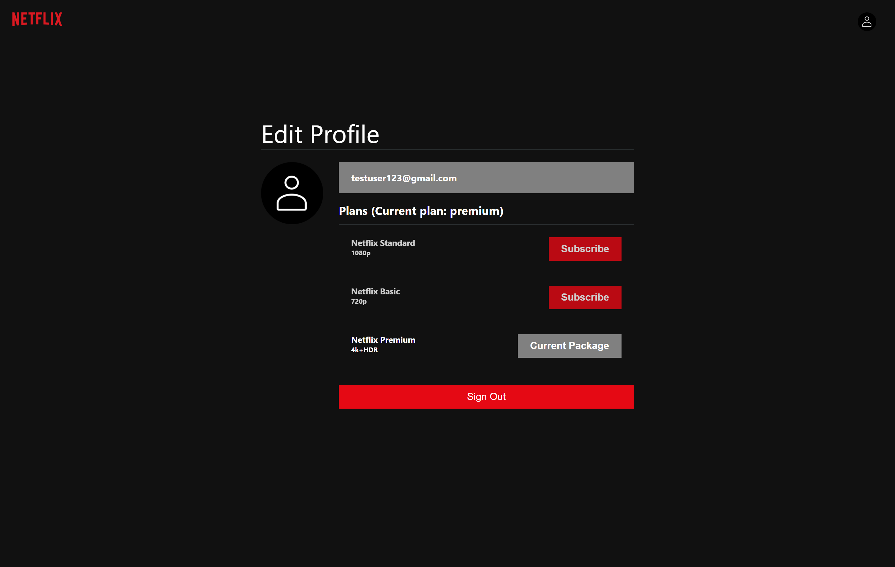
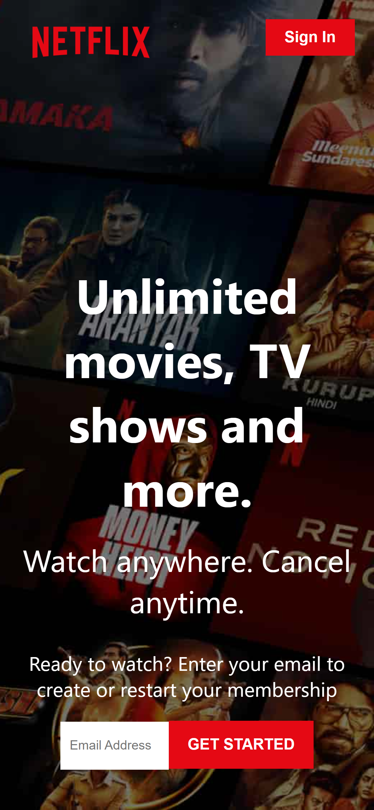
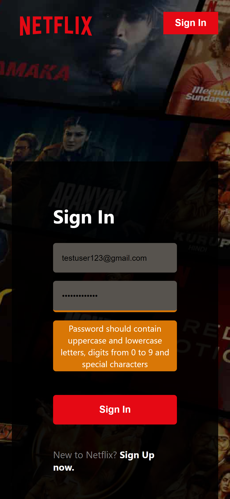
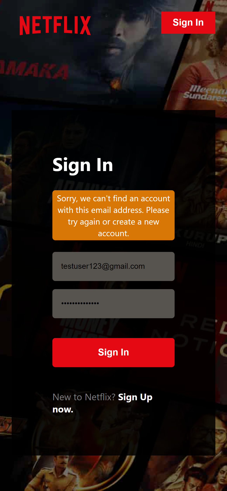
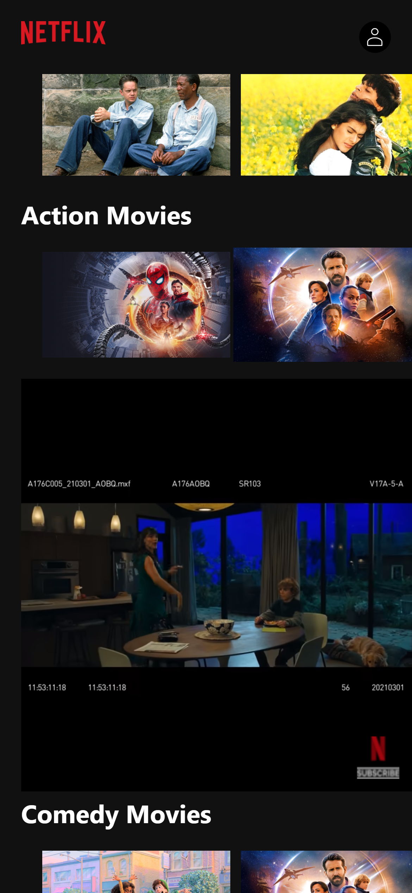

# Netflix Build

## Table of contents

- [Overview](#overview)
  - [Demo](#demo)
  - [Screenshot](#screenshot)
    - [Desktop](#desktop)
    - [Mobile](#mobile)
  - [Links](#links)
- [My process](#my-process)
  - [Built with](#built-with)
  - [What I learned](#what-i-learned)
- [Author](#author) 

## Overview
A Netflix clone demonstrating my abilities in React JS to build something advanced like Netflix. It consists of a home screen, sign-in screen with validation using react-hook-form, sign -up screen, home screen depicting various shows according to categories and a movie player to play the trailer of the respective show as per the user's liking.
### Demo

### Screenshots

#### Desktop

#### Mobile

### Links

- Solution URL: [https://github.com/NandodkarAmogh/netflix-clone](https://github.com/NandodkarAmogh/netflix-clone)
- Live Site URL: [https://react-netflix-build.netlify.app/](https://react-netflix-build.netlify.app/)

## My process

### Built with

- Mobile-first workflow
- [React](https://reactjs.org/) - JS library
- [React-Hook-Form](https://react-hook-form.com/)- form validation
- [The MovieDB API](https://developers.themoviedb.org/3)
- [Firebase] (https://firebase.google.com/) - for user authentication
### What I learned

The biggest lesson I learnt while building this project was how to break the whole project into smaller chunks and then accumulating these at the end to build back the application. I used CSS3 for designing which helped me in revisiting important concepts like flexbox and media queries. I also worked with react-hook-form for form validation and firebase for user authentication.

## Author

- Github - [@NandodkarAmogh](https://github.com/NandodkarAmogh)
- Portfolio - [https://amoghnandodkar.netlify.app/](https://amoghnandodkar.netlify.app/)

